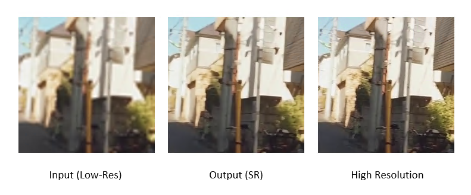

# Real-time Lightweight CARN Super-Resolution with Edge Prior

### About this work
This is an implementation of Super-Resolution model call "CARN" and Edge prior. We design this model for a real world task
by integrate into Real-time Streaming from one place to other using WIFI network.
(This work is still on progress)

### Requirements
- Python 3
- PyTorch
- openCV2
- Numpy, Scipy
- Pillow, Scikit-image
- ZED camera
- pyzed.sl

### Train Hardware
GPU : GTX 2080 Super
CPU : i7-9700F

### Dataset
We retrive dataset of 2k 10000 from real world along with DIV2K dataset.

### Test Pretrained Models
python realtime_test.py

### Training Models
python train.py
